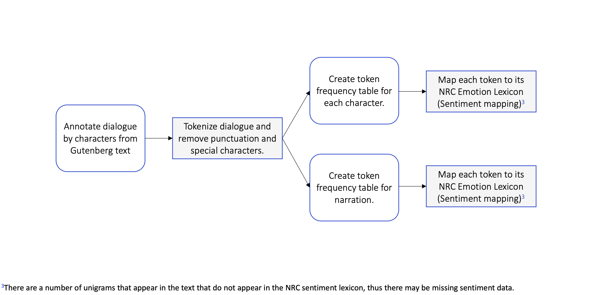

```{r setup, include=FALSE}
knitr::opts_chunk$set(echo = TRUE)
set.seed(1001411509)

library(rvest)

# String manipulation
library(stringr)

# Verbose regular expressions
library(rebus) 

# List utils
library(rlist)

library(corpus)

library(ggplot2)

library(tidytext)

library(tidyr)
library(dplyr)
library(scales)

library(rticles)

'%ni%' <- Negate('%in%')

knitr::read_chunk('analysis.R')
```

```{r load_data, echo=FALSE}
# Load the HTML file and prepare for parsing.
```

```{r clean_data, echo=FALSE}
```

```{r tokenization, echo=FALSE}
```

```{r sentiment, echo=FALSE, warning=FALSE}
```

```{r sentiment_summary, echo=FALSE}
```

```{r overall_proportion, echo=FALSE}
```

# Abstract

*The Adventure of the Six Napoleons* by author A. C. Doyle tells a short story of a curious case of a serial burglar turned murderer. The only link between the multiple burglaries is in the destruction of replica busts of Napoleon the First. In this short story, Doyle utilizes dialogue as a primary means of storytelling and uses narration only to supplement the conversations of the characters. Not only does conversation lend a unique voice to the characters, but it also develops their personas and serves to advance the plot dynamically. The interactions of these characters with Sherlock Holmes reveal a sort of implicit confidence in their willingness to cooperate with him in the investigation that forms the majority of the plot.
By using naive text analysis methods to identify sentiment within the dialogue and measuring the conversational contributions of the various characters using count based metrics, this preliminary research provides two key insights. 1) The relationship between dialogue and narration as a stylistic choice by Doyle to tell the story and 2) the sentiments of the characters in their interactions with Holmes as persons of interest. Finally, this research offers casual conclusions about how certain attitudes expressed by the characters reinforce the anticipatory and suspenseful atmosphere of Doyle's short crime/mystery story.

# Introduction

This research investigates the short story, *The Adventure of the Six Napoleons*, by A. C. Doyle, and featuring the infamous literary character Sherlock Holmes through the lens of naive text analysis. Specifically, this research explores the use of narration and dialogue by Doyle as a stylistic means of progressing the short story. In addition, this research aims to determine what proportion of the story is dialogue and what proportion is narration, and within the proportion of conversation, what sentiments the various characters are expressing.

As a reader, an observation that is rather evident is that a large portion of the short story is in the format of conversation, exactly how much is not entirely obvious. To determine exactly how much is conversations, the number of meaningful words as aggregated as counts seperated into two categories, dialogue and narrative. The category of dialogue is itself further subdivided by aggregated counts of meaningful words by each character. Intuition suggests that due to the type of genre of the story, a crime/mystery, the attitudes will generally be *negative* as defined in the context of sentiments, but specifically there will be fair amount of *fear* and *aniticipation* expressed by the characters as the story progresses and until finally the mystery is sovled.

# Methods

The methods of transforming and processing the short story are documented at a high-level in this research but can also be viewed in their entirety in the accompanying `RMarkdown` source notebook.

**PREPARING THE DATA**

The original text for the short story was taken from the *[Gutenberg repository](http://www.gutenberg.org/files/108/108-h/108-h.htm#linkH2H_4_0008)* and then manually annotated by paragraph according to the character who is speaking.

Once the data is annotated, it is loaded and transformed in the following manner:

1. Transform the text into lowercase strings to remove distinction of terms with regards to capitalization.
2. Drop all non-supported symbols and punctuation[^symbols], with the exception of the quotation marks. Trim to remove leading and trailing whitespace in the resulting strings.
3. Extract all text which is encapsulated within quotation marks (considered to be *conversation*). The resulting utterances are labelled with the name of their associated character. This step excludes the text chunks which are part of the narration (any chunks which are not explicitly spoken by a character).
4. Finally, all seperate utterances by a given character are joined into a single large string, which is then ready for further processing.

After the above transformations are complete, the large strings can then be tokenized[^tokenized] in preperation for sentiment analysis and counting.

**AGGREGATING TOKEN COUNTS**

The tokenization process involves taking the large strings from the preperation step and splitting them into their corresponding collections of tokens. These tokens are already associated with their corresponding character and the number of words associated with a given character are simply the size of the collection. The narration is treated as a character but not included in the count of the total number of tokens within dialogue and is instead used as its own category.

**IDENTIFYING SENTIMENT**

The method of identifying sentiment is through unigram classification/labeling using the [NRC Emotion Lexicon](http://saifmohammad.com/WebPages/NRC-Emotion-Lexicon.htm)[^lexicon_effectiveness]. At this point, the strings have already been tokenized. What remains is to label each existing token to its corresponding sentiment(s)[^multiple_sentiments], and compute the proportions of each sentiment grouped by character.

```{r pressure, echo=FALSE, fig.cap="The process of preparing, transforming, and analysing visualized as a flowchat.", out.width = '100%', fig.pos="h", out.extra = ""}

```

# Results

The results from the token aggregation and sentiment labelling are summarized in the following visualizations:

&nbsp;

```{r echo=FALSE, fig.height=7, fig.width=12}
metadata.plot
```

The results of the counts of the tokens in speech for a given character (*Figure 1*) show that of the ten characters which participate in the conversation, Holmes has more (almost double) tokens in his utterances than the other characters. Followed closely by Lestrade and subsequently by the other supporting characters and finally Watson.

&nbsp;

```{r echo=FALSE, fig.height=7, fig.width=12}
sentiment.plot
```

The sentiment chart of the characters (*Figure 2*) shows the proportion of the various sentiments extracted from the tokens and range from anger to trust. As previously indicated, the tokens are labelled using the NRC Emotion Lexicon and since words can contain multiple different sentiments there is a certain level of overlap between the proportions. An important distinction that also needs to be made is that not all tokens are associated with a given sentiment[^missing_sentiments], as such the proportions of sentiments do not exactly correspond to character token proportions.

&nbsp;

```{r echo=FALSE, fig.height=7, fig.width=12}
sentiment.summary.plot
```

The sentiment averages across the characters is most high for Trust (`r signif(sentiment.summary$average[8] * 100, 2)`%), followed closely by Fear (`r signif(sentiment.summary$average[4] * 100, 2)`%) and Anticipation (`r signif(sentiment.summary$average[2] * 100, 2)`%).

&nbsp;

```{r echo=FALSE}
metadata.prop.plot
```

Finally, in comparing the overall proportion of tokens in speech by the various characters and the tokens in narration, the token counts indicate that a majority (`r signif(metadata.prop$proportion[2] * 100, 2)`%) of the short story is conversation in comparison to raw narration (`r signif(metadata.prop$proportion[1] * 100, 2)`%).

# Conclusion & Next Steps

The counts of the tokens in utterances by character in *Figure 1* indicate a significant imbalance of tokens in favour of Holmes — `r 0`%. This is likely the result of the overall focus on Holmes by Doyle, and thus a majority of the content is based around Holmes and his interactions with the other characters. In particular, Lestrade, the Inspector, follows in the number of tokens likely as a result of the nature of the story and Lestrade's interactions with Holmes which make up the bulk of the story. The rest of the characters make smaller contributions to the progression of the short story, which can be seen in the sentiment chart.

From *Figure 2* shows a large number of tokens which indicate trust followed by anticipation and fear. This is inline with the demeanour of the characters in their interactions with Holmes which make up the bulk if not all of their utterances. Since Holmes' character is associated with the police and has a level of genius which lends itself to reverence of sorts, it is not out of the ordinary that the other characters would evoke sentiments of trust.[^5] Further, the content of their conversations are riddled with references to not only the burglary but the murder and as such would evoke sentiments of fear and anticipation in hopes of closing the case.

The anticipation, fear and trust, which are the three most prominent sentiments expressed by the characters are all telltale emotions which are pillars of a story within the genre of mystery. These sentiments help reinforce the themes of the genre, in particular the anticipation and fear are both used to attract the reader and build up the overall mystery.

Finally, the overall proportion of conversation seen in *Figure 3* confirms the initial intuition of the majority, `r signif(metadata.prop$proportion[1] * 100, 2)`%, of the short story being driven primarily by conversation and that too by Holmes. This means that the sentiments of the characters make up a larger proportion of the story and as a result, more weight can be placed on the prominent sentiments as representation of the the larger story.

The next steps would be to apply this methodology to investigate the trends in other adventures in the larger collection of short stories by A. C. Doyle and to determine if these trends are ubiquitous across Doyle's work with regards to Sherlock Holmes and to further investigate and evaluate the sentiments that are associated with the characters in these short stories and whether some prevailing sentiments can be identified.

# Limitations and cautions

- The data leveraged in this work is of a rather small sample size. The analysis only contains the data from a single story and has no baseline to measure the above results of the text analysis. An application of the previously defined Process on other Holmes adventures by Doyle would provide additional data with which to base further comparison and verification.
- The NRC Emotion Lexicon is based on a sentiment classification from the 2000s, for the purposes of a naive exploration of sentiments it is adequate but it lacks the accuracy and breadth that a lexicon that was from the same time period as the text would have had.
- The mapping of sentiments are not aware of context — some words such as affection may be considered to be associated with joy but when in a sentence like ‘lack of affection’, the words means something totally different.
- Some tokens have no, or have an ambiguous sentiment associated with them and may remove certain words from consideration due to this lack of association.

# Future work

this research does not even scratch the surface on what can be further explored and as a result, there are many possible avenues for furture work. Perhaps the most obvious and easiest to persue next would be to explore other Holmes adventures to determine trends and validate conclusions about author style with respect to the narration and dialogue imbalance. Then more work could be done to identify and implement a more accurate sentiment mapping mechanism for the tokens within the texts so that they are more reflective of the time-period as well as the larger context in which the tokens were being used.
The most exciting is likely an investigation into machine learning implementations of the resulting classification of character personality by using the
distribution of sentiments to identify if a particular character is speaking in a given conversation.


# References

- Agarwal, Basant. “Personality Detection from Text: A Review.” International Journal of Computer System, vol. 1, no. 1, Sept. 2014, https://pdfs.semanticscholar.org/6382/979985397c1f9b3f1cca296034e78c82a46c.pdf.
- Kempton, Gloria. Write Great Fiction: Dialogue: Techniques and Exercises for Crafting Effective Dialogue. Writers Digest Books, 2004.
- Mohammad, Saif. NRC Word-Emotion Association Lexicon, National Research Council Canada (NRC), 2010, http://saifmohammad.com/WebPages/NRC-Emotion-Lexicon.htm.
- Perry, Patrick O., and et. al. “Stemming Words.” Corpus: Text Corpus Analysis, The Comprehensive R Archive Network, 2017, https://cran.r-project.org/web/packages/corpus/vignettes/stemmer.html.

[^meaningful_words]: Meaningful words are considered to be those which are not stopwords. Stopwords include unigrams such as “and”, “the”, “is”, “at”, etc.
[^symbols]: Non-supported symbols include carridge returns (\\n) and hyphens (—). Punctuation is any of the following — `.,!?;`. 
[^tokenized]: Strings are split into unigrams which are then filtered to remove stopwords and finally, the resulting unigrams are stemmed to their root lexigraphical forms.
[^lexicon_effectiveness]: There are a number of unigrams that appear in the text that do not appear in the NRC sentiment lexicon, thus there may be missing data that could paint a slightly different picture — these unigrams are listen in the Appendix.
[^multiple_sentiments]: Each token can have more than one associated sentiment. As a result, the sentiments are measured in the proportion of tokens for a given sentiment to their overall token counts.
[^missing_sentiments]: Tokens which do not have a sentiment associated with them are either tokens which provide no additional meaning (e.g stopwords), or simply words that do not have a labelled stopword within the lexicon.
[^4]: There may be concerns about the validity of the selected sentiments since the lexicon used in the Holmes adventures could vary in comparison to those in the NRC lexicon (primarily due to temporal differences -- early 1900s vs 2010). For the purposed of this rudementary reseach, it is assumed that this lexicon is satisfactory in its labeling of emotion to words.
[^5]: “if you come down to-morrow, there’s not a man, from the oldest inspector to the youngest constable, who wouldn’t be glad to shake you by the hand” (Doyle).
